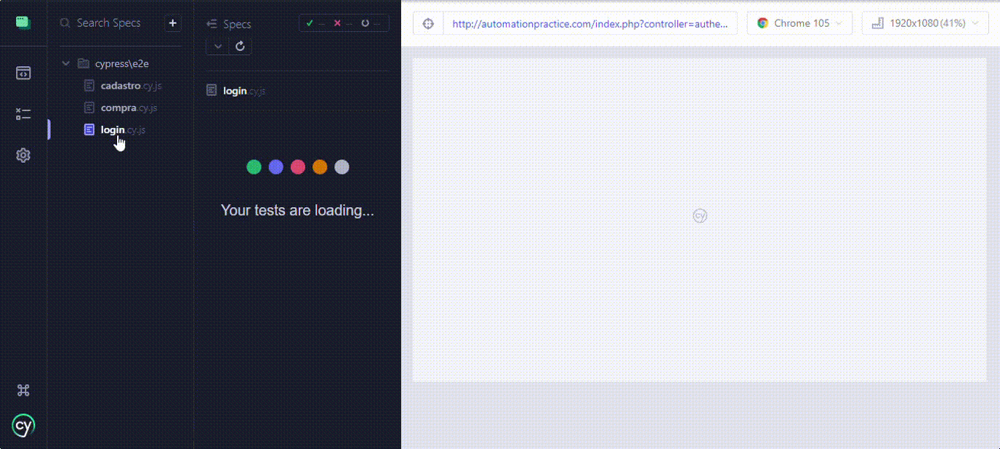

<h1 align="center">
Projeto automation practice - Cypress
</h1>

## Descrição 

Projeto feito para realizar testes automatizados de uma aplicação que simula uma loja de roupas, nesse projeto foram feitos testes de fluxo positivo e negativo. Os testes foram feitos em alguns cenários diferentes, como o de Login, cadastro e o de compra realizando todos os passos da compra e do pagamento. Os testes foram feitos com o padrão page objects.

## 🛠 Ferramentas

* VisualStudioCode
* JavaScript
* Cypress
* Node.js

## Preview

### Cenário - Cadastro 

* registrando um usuário
* menssagem de erro de email ja existente
* mensagems de erro ao inserir dados de cadastro inválidos

### Cenário - Login

* usuario deve efetuar o login
* mensagem de erro ao inserir email inválido
* mensagem de erro ao inserir password inválido

### Cenário - Compra

* realizando compra

## 🤝 Contato

matimeneses10@gmail.com

